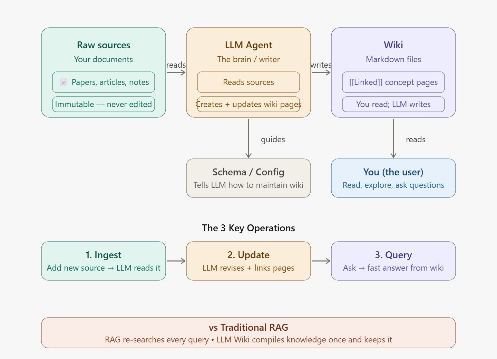

# 🧠 LLM Wiki — Complete Guide

> *A new way to build AI-powered knowledge bases that remember, grow, and stay organized — automatically.*

---

## 📌 Table of Contents

1. [What is LLM Wiki?](#what-is-llm-wiki)
2. [Architecture](#architecture)
3. [How It Works](#how-it-works)
4. [The 3 Core Operations](#the-3-core-operations)
5. [Advantages of LLM Wiki](#advantages-of-llm-wiki)
6. [LLM Wiki in RAG Systems](#llm-wiki-in-rag-systems)
7. [LLM Wiki vs Traditional RAG](#llm-wiki-vs-traditional-rag)
8. [When to Use What](#when-to-use-what)

---

## 🤔 What is LLM Wiki?

An **LLM Wiki** is an AI-maintained knowledge base that automatically reads your documents and organizes everything into a structured, interlinked set of wiki pages — like Wikipedia, but it writes and updates itself.

> Proposed by **Andrej Karpathy** (co-founder of OpenAI) in April 2026.

### The Core Idea

Instead of making an AI search through raw documents every time you ask a question, you let the AI **compile the knowledge once** into organized pages — and then query from those pages.

```
Traditional approach:  Question → Search raw docs → Generate answer  (every time)
LLM Wiki approach:     Docs → Compile wiki once → Question → Answer  (fast, structured)
```

### Simple Analogy

Think of it like a **textbook vs a pile of papers**.

- **Pile of papers** = your raw documents (hard to search, no structure)
- **Textbook** = the LLM Wiki (organized chapters, index, cross-references)

The LLM is the author that turns your pile of papers into a textbook — automatically.

---

## 🏗️ Architecture

LLM Wiki has **3 layers** that work together:



> **Reading the diagram:**
> - **Raw Sources** (green) → your documents, immutable, never edited
> - **LLM Agent** (orange) → reads sources, creates and updates wiki pages
> - **Wiki** (purple) → linked markdown files that you read and explore
> - **Schema / Config** (grey) → tells the LLM how to structure and maintain pages
> - **You** (blue) → read the wiki, ask questions, explore links
> - The 3 key operations flow left to right: **Ingest → Update → Query**
> - Bottom bar: LLM Wiki compiles knowledge once vs RAG which re-searches every query

### Layer 1 — Raw Sources (Your Documents)

Your original documents — PDFs, markdown files, articles, research papers, notes.

- **Immutable** — never modified
- These are your source of truth
- Can be any format: `.pdf`, `.md`, `.txt`
- The LLM reads from here but never writes here

### Layer 2 — LLM Agent (The Brain)

The AI model that does all the heavy lifting.

- Reads raw documents
- Extracts concepts, entities, topics
- Writes new wiki pages
- Updates existing pages when new info arrives
- Maintains cross-links between pages
- Detects contradictions and flags them

### Layer 3 — Wiki Pages (The Output)

A folder of structured markdown (`.md`) files — one per concept.

- **Human-readable** — open any file to read it
- **Interlinked** — pages reference each other with `[[WikiLinks]]`
- **You read it; the LLM writes it**
- Can be viewed in **Obsidian** as a beautiful graph

### The Schema / Config File

A configuration file that tells the LLM:
- How to structure each page
- What conventions to follow (headings, links, sources)
- How to handle contradictions
- What deserves its own page vs what is a bullet point

---

## ⚙️ How It Works

### Step-by-Step Flow

```
 📄 You add a document
        │
        ▼
 🤖 LLM reads the full document
        │
        ▼
 🔍 LLM checks existing wiki pages
   (to avoid duplicates, find cross-links)
        │
        ▼
 📝 LLM creates / updates wiki pages
   - One page per concept
   - Adds [[links]] to related pages
   - Notes source document
   - Flags contradictions with existing pages
        │
        ▼
 💾 Pages saved as .md files
        │
        ▼
 ❓ You ask a question
        │
        ▼
 📚 Answer comes from compiled wiki
   (NOT from re-reading raw documents)
```

### What a Wiki Page Looks Like

```markdown
# BGE-M3

BGE-M3 is an open-source embedding model from BAAI that supports
dense, sparse, and multi-vector retrieval in a single model.

## Key Points
- Supports 100+ languages
- Context window: 8192 tokens
- Three retrieval modes: dense, sparse, ColBERT
- Built on XLM-RoBERTa backbone

## Related
- [[Dense Retrieval]]
- [[Hybrid Search]]
- [[Vector Databases]]
- [[RAG]]

## Sources
- rag_and_embeddings.md

---
*Last updated: 2026-06-17 | Source: rag_and_embeddings.md*
```

### The `[[WikiLink]]` System

Every concept links to related concepts using `[[Double Brackets]]`.
This creates a **knowledge graph** automatically — you can visualize it in Obsidian.

```
         [[RAG]]
        /       \
[[Embeddings]]  [[Vector DB]]
      |               |
  [[BGE-M3]]     [[Qdrant]]
      |
[[Hybrid Search]]
      |
[[Re-ranking]]
```

---

## 🔄 The 3 Core Operations

### 1. 📥 Ingest

Feed a document into the wiki.

```python
ingest("my_paper.pdf")
```

**What happens:**
- Document text is extracted
- LLM reads it + checks existing wiki
- New pages created / existing pages updated
- All cross-links added automatically

### 2. 🔍 Query

Ask a question — answered from the compiled wiki instantly.

```python
answer = query("What is hybrid search and when should I use it?")
```

**What happens:**
- LLM reads the pre-compiled wiki pages
- Answers directly from organized knowledge
- Cites relevant pages: `(see [[Hybrid Search]])`
- No re-reading raw documents needed

### 3. ✏️ Update

Add new information to an existing page.

```python
update_page("BGE-M3", "New benchmark shows 12% improvement on MIRACL 2026.")
```

**What happens:**
- LLM opens the existing page
- Merges new info intelligently
- Keeps structure and cross-links intact
- Flags contradictions with `⚠️ Note:`

---

## ✅ Advantages of LLM Wiki

### 1. Knowledge is Compiled Once
Raw documents are read once and compiled into organized pages.
No need to re-process every time you ask a question.

### 2. Persistent Memory
The wiki grows over time. Add more documents → more pages → richer knowledge.
Unlike a plain chat session, knowledge doesn't disappear.

### 3. Human Readable
Every wiki page is a plain markdown file.
You can open, read, edit, or share them without any special tool.

### 4. Knowledge Graph / Cross-Links
`[[WikiLinks]]` automatically connect related concepts.
You can explore the graph visually in Obsidian.

### 5. Contradiction Detection
When new information conflicts with existing pages,
the LLM flags it explicitly instead of silently overwriting.

### 6. Fast Querying
Querying reads from clean, structured wiki pages —
not from messy raw documents with irrelevant text.

### 7. Easy to Update
Add a new document → only affected pages get updated.
No need to re-index or re-embed everything.

### 8. Model Agnostic
Works with any LLM — GPT-4, Claude, Llama, Gemini.
Swap the model anytime without changing the wiki structure.

---

## 🔗 LLM Wiki in RAG Systems

This is where LLM Wiki becomes very powerful.
Instead of using raw documents as your RAG knowledge base,
**you use the wiki pages as your RAG knowledge base.**

### Traditional RAG Pipeline

```
User Query
    │
    ▼
Embed Query
    │
    ▼
Search Raw Chunks ◀── (messy, noisy, unstructured)
    │
    ▼
Retrieve Top-K Chunks
    │
    ▼
LLM generates answer
```

### RAG + LLM Wiki Pipeline

```
User Query
    │
    ▼
Embed Query
    │
    ▼
Search Wiki Pages ◀── (clean, structured, pre-summarized)
    │
    ▼
Retrieve Relevant Pages
    │
    ▼
LLM generates answer  ◀── (much better context)
```

### Why Wiki Pages are Better RAG Chunks

| Property | Raw Document Chunks | Wiki Pages |
|---|---|---|
| Structure | Random text cuts | Organized sections |
| Noise | High (headers, footers, boilerplate) | Low (only key info) |
| Context | Fragment of a sentence | Full concept explanation |
| Cross-links | None | `[[Related]]` pages |
| Deduplication | Same info repeated across chunks | One page per concept |
| Size control | Fixed chunk size | Concept-appropriate length |
| Readability | Often broken mid-sentence | Complete, readable |

### Specific Advantages in RAG

#### Better Retrieval Quality
Wiki pages are pre-summarized and cleaned.
When you embed a wiki page, the vector actually represents the concept well —
not a random cut of a paragraph.

#### Less Hallucination
RAG answers are grounded in structured, verified wiki pages
instead of noisy raw chunks that might contradict each other.

#### Automatic Deduplication
If 5 documents all mention BGE-M3,
traditional RAG retrieves 5 overlapping chunks.
LLM Wiki merges them into one `BGE-M3` page — cleaner context for the LLM.

#### Cross-Document Knowledge Fusion
Information from Document A and Document B
about the same topic gets merged into one wiki page automatically.
RAG normally can't do this — it retrieves chunks in isolation.

#### Graph-Aware Retrieval
Since wiki pages link to each other,
you can do **graph traversal retrieval** —
retrieve the main page, then follow `[[links]]` to related pages.
This gives much richer context than flat chunk retrieval.

```python
# Example: graph-aware retrieval
pages = retrieve("BGE-M3")          # finds BGE-M3 page
linked = follow_links(pages)         # also fetches [[Hybrid Search]], [[Dense Retrieval]]
answer = llm_answer(query, linked)   # richer context → better answer
```

#### Easier Re-indexing
When you add a new document:
- **Traditional RAG** → re-chunk, re-embed, update vector DB
- **LLM Wiki RAG** → update only the affected wiki pages, re-embed just those

---

## ⚖️ LLM Wiki vs Traditional RAG

| Feature | Traditional RAG | LLM Wiki RAG |
|---|---|---|
| Knowledge storage | Raw chunks in vector DB | Structured wiki pages |
| Query time | Re-search raw docs | Read pre-compiled pages |
| Speed | Slower (more chunks) | Faster (fewer, cleaner pages) |
| Deduplication | None | Automatic |
| Cross-doc fusion | None | Automatic |
| Human readability | Low | High |
| Knowledge graph | No | Yes (`[[WikiLinks]]`) |
| Update cost | Re-embed everything | Update affected pages only |
| Contradiction handling | Silent | Flagged explicitly |
| Best for | One-off Q&A | Ongoing knowledge accumulation |

---

## 🎯 When to Use What

### Use Traditional RAG when:
- You have a huge document collection (millions of docs)
- You need exact text retrieval (legal, compliance)
- Documents change very frequently
- You're doing a one-off project

### Use LLM Wiki when:
- You're building a personal knowledge base
- You read and accumulate documents over time
- You want human-readable, explorable knowledge
- You want cross-document knowledge fusion
- You're building a team knowledge base

### Use LLM Wiki + RAG together when:
- You want the best of both worlds
- Build the wiki first, then use wiki pages as RAG chunks
- This gives clean retrieval + structured context + fast answers

---

## 🛠️ Tools to Explore Your Wiki

| Tool | Purpose |
|---|---|
| **Obsidian** | View wiki as a graph, click through `[[links]]` |
| **VS Code** | Edit markdown files directly |
| **Any text editor** | Read individual pages |
| **Python** | Query programmatically via `query()` function |

> 💡 **Tip:** Open your `/wiki_pages/` folder in Obsidian and click *Graph View* to see all your concepts as a connected network — it's very satisfying to watch it grow as you add more documents!

---

*Built with LLM Wiki engine | Powered by Llama-3.3-70b via Groq*
